<a id="readme-top"></a>
<div align="center">

  <h1 align="center">NanoMi</h1>

  <p align="center">
    NanoMi: The world’s first open-source transmission electron microscope
    <br />
    <a href="https://nrc.canada.ca/en/research-development/nanomi-worlds-first-open-source-transmission-electron-microscope"><strong>Explore the NRC Website »</strong></a>
    <br />
    <a href="https://osf.io/bpj73/"><strong>Explore the OSF Wesite »</strong></a>
    <br />
    <br />
    <a href="https://www.youtube.com/watch?v=sMi-UkWSFS8&ab_channel=NationalResearchCouncilCanada">View Video</a>
    ·
    <a href="https://github.com/NRC-NANOmi/NanoMi/issues">Report Bug</a>
    ·
    <a href="https://github.com/NRC-NANOmi/NanoMi/issues">Request Feature</a>
  </p>
</div>


<!-- TABLE OF CONTENTS -->
<!-- <details> -->
  <summary>Table of Contents</summary>
  <ol>
    <li>
      <a href="#about-the-project">About The Project</a>
    </li>
    <li>
      <a href="#getting-started">Getting Started</a>
      <ul>
        <li><a href="#acessio-aiousb">AcessIO AIOUSB</a></li>
        <li><a href="#naomi-control-software-installation">Naomi Control Software Installation</a></li>
      </ul>
    </li>
    <li>
      <a href="#usage">Usage</a>
      <ul>
        <li><a href="#nanomi-control-software">NanoMi Control Software</a>
          <ul>
            <li><a href="#hardware-io">Hardware IO (DAC/ADC set up)</a></li>
            <li><a href="#deflector-control">Deflector Control</a></li> 
            <li><a href="#stigmator-control">Stigmator Control</a></li> 
            <li><a href="#data-set">Data Set</a></li>
          </ul>
        </li>
      </ul>
    </li>
    <li><a href="#contributing">Contributing</a></li>
    <li><a href="#license">License</a></li>
    <li><a href="#contact-info">Contact Info</a></li>
  </ol>
<!-- </details> -->


<!-- ABOUT THE PROJECT -->
## About The Project

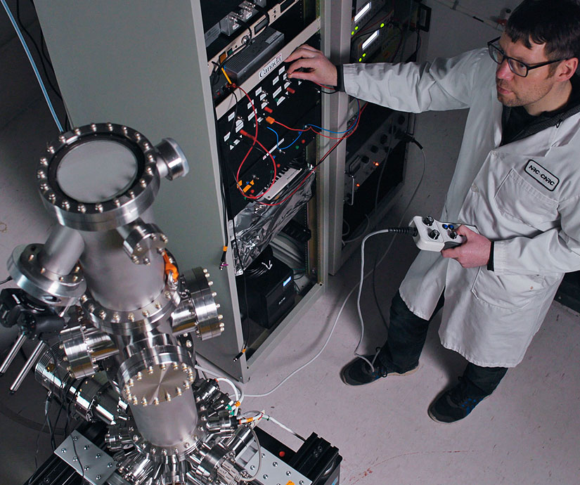

NanoMi is an open source, modular TEM for ultra-high vacuum that we have built at NRC and are sharing with the public to promote microscopy. It is available to build, add to any system and modify. Feel free to contribute to the project; all that the open source license requires is for you to give back by adding any of your modifications and updates to the project. Keep reviewing the OSF website for new additions as we progress.

This reposiotry contains software of the NanoMi poject, including the NanoMi Control software, NanoMi 3D visualizer, and different optical scripts.

We haven't release any hardware specificantions yet due to legal concern of potiential safety issue, but it is in our plan. Keep tracking our github and OSF so you won't miss when the hardware specifications are released!

The major software is the NanoMi Control software, so the rest of the documention will be around the installation and usuage of it.

<p align="right">(<a href="#readme-top">back to top</a>)</p>


<!-- GETTING STARTED -->
## Getting Started
Currently our software only support on Linux, and we suggest using openSUSE Tumbleweed. 

### AcessIO AIOUSB 

_The digital IO for NanoMi is built with AccessIO AIOUSB, so before install the software, make sure install AccessIO AIOUSB on your system._

1. Install required libraries for AIOUSB
    ```sh
      sudo zypper install fxload
      sudo zypper install gcc-c++
      sudo zypper install libusb-1_0-devel
      sudo zypper install cmake
      sudo zypper install swig
      sudo zypper install git
    ```

2. Install AIOUSB from github
    ``` sh
      git clone https://github.com/accesio/AIOUSB.git
      cd AIOUSB/
      git fetch
      git checkout USB-AIO16-16F
      git clean -df
      cd AIOUSB/
      mkdir build
      cd build/
      cmake ..
      make
      sudo make install
      cd ..
      sudo cp Firmware/*.hex /usr/share/usb/
      sudo cp Firmware/10-acces*.rules /etc/udev/rules.d
    ```

  3.   Copying the .hex files into /usr/share/usb/ puts the firmware files that need to be loaded into the        hardware in a known, static place.

  4.  Copying the .rules files into /etc/udev/rules.d makes a script be run anytime an AccesIO USB hardware device is found, and automatically loads the firmware onto it for you.

  5. Ensure that the 10-acces_usb.rules file points to the correct location for fxload! A computer restart may be required if it's not and you modify it. Proper location should be something like /usr/sbin/fxload ?
<p align="right">(<a href="#readme-top">back to top</a>)</p>

### Naomi Control Software Installation

_Below is the instrution of Naomi Control Software Installation_

1. Clone the repo
   ```sh
   git clone https://github.com/NRC-NANOmi/NanoMi.git
   ```
2. Go to the folder contains the NanoMi Control Software
   ```sh
   cd Software
   ```
3. Install required packages using pip
   ```sh
   pip install -r requirements.txt
   ```
4. Run the software
   ```sh
   python NANOmi.py
   ```

<p align="right">(<a href="#readme-top">back to top</a>)</p>


<!-- USAGE EXAMPLES -->
## Usage

### NanoMi Control Software
- ### Hardware IO (DAC/ADC set up) <a id="hardware-io"></a>
  
  The software will scan all the connected digital IO boards when it starts, and list all the pins in the hardware module.

  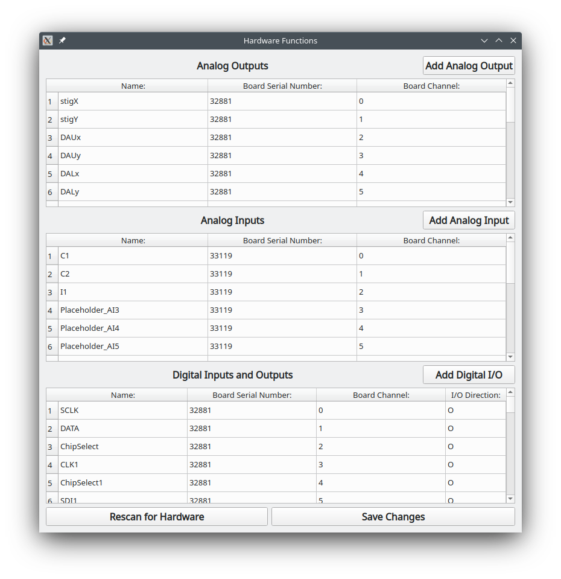

  All the pins are categorized into three (Analog Outputs, Analog Inputs and Digital Input Output). Each pin has an assigned name, if you haven't assign, it will auto assign a name like Placeholder_xxx. You can rename every pin, and in other modules when you try to select one pin, it will display the nick name you assigned. 

  The Board Serial Number and Board Channel are generated by scanning the board, and they are immutable, so you can't change any those data. However, incase the scanning has unexpected problems, at the top right corner of each section, you can see an Add Button. By input name, Board Serial Number and Board Channel that, you can add pins that are unscanned.

  User can also rescan the hardware by clicking the rescan for hardware button. The software will rescan the connection boards and reread the IO assignment file and load pins again.

  After making any changes please press the save changes button before using any of the changed pins, then all the current IO assignment will be stored in IoAssignments.txt. The previous version of the the assignment will be saved as IoAssignments_date_time.txt as backup.
  <p align="right">(<a href="#readme-top">back to top</a>)</p>

- ### Deflector Control
  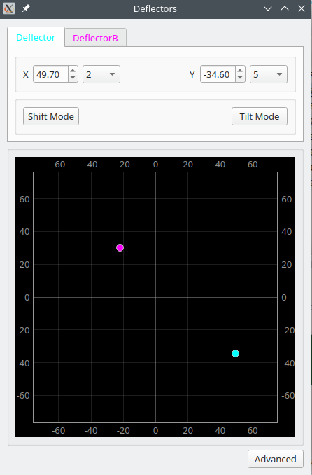

    The deflector module can control multiple deflectors, the user change to the control for different deflectors by changing different tabs.

    The deflector control has two inputs, X and Y. You can directly type value into the input box, clicking the arrows, or scroll on the input box to change the input. The drop down box is the increment, you can change it to fit your accurency need. You can also directly drag the dot on the plot to change the value.

    For Single plate deflector, its layout and control is shown in the following figure.
    
    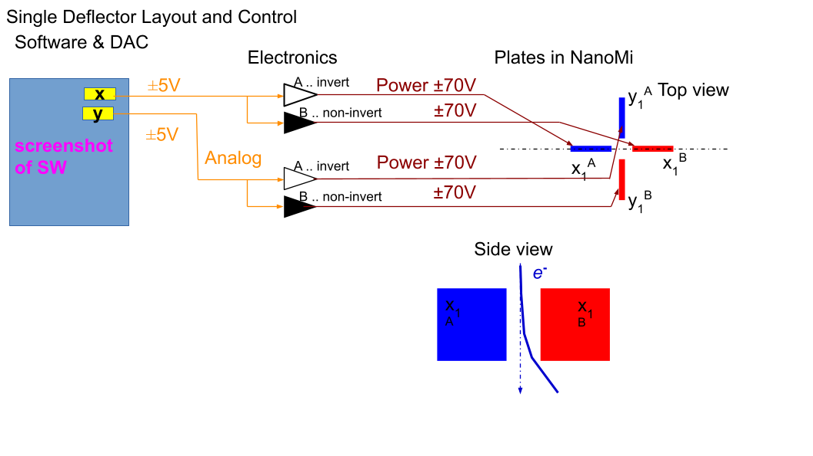

    The NanoMi control software also supports double plates deflectors, for double plates deflector the software supports shift and tilt mode, by clicking the button, the software will apply the corresponding ratio to the output. The layout and control for double plates deflector is shown in the following figure.
    
    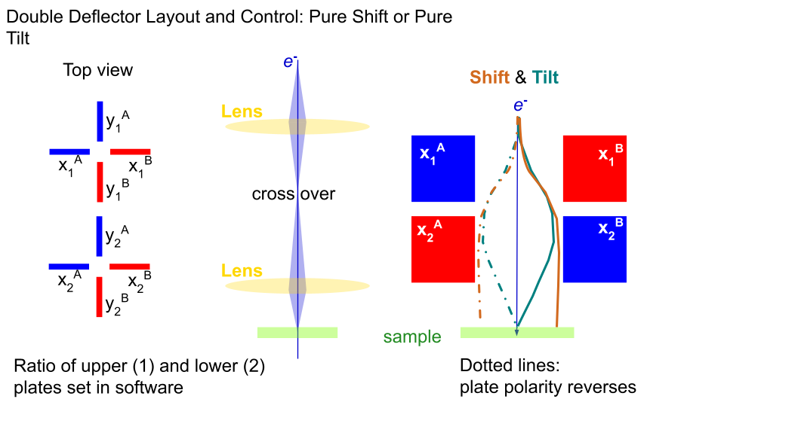

    The Advanced button leads to advanced setting of the deflectors. Inside the advanced setting, you can create a new deflector by pressing the add button. The x1/x2/y1/y2 are drop down menu which contains all the names of analog outputs that you assigned in hardware module. Make sure to click save if you made any changes. All the settings are store in a xml file called DeflectorSettings.xml, if you have any special need, you can directly change the setting in the xml file as well.

    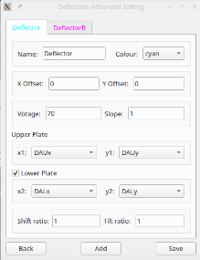
    <p align="right">(<a href="#readme-top">back to top</a>)</p>

- ### Stigmator Control
 
  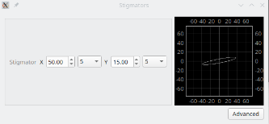
  
    A stigmator is a component that reduces astigmatism of the beam by imposing a weak electric or magnetic quadrupole field on the electron beam. It corrests the shape of the beam.

    The stigmator control is similar as the deflector control, it also has two inputs X and Y. However, not like deflector, stigmators have 8 plates, the following figures show the detailed layout and circuit of the stigmator, and its effect on the beam.

    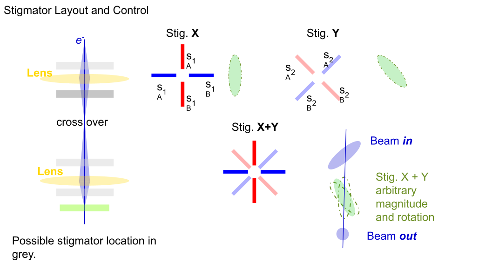
    

    There is a plot next to each stigmator control, it is a simulation of the beam shape that applies the effect of the stigmator.

    As same as deflector, the stigmator also has an advanced button that leads to advanced settings, the set up of stigmators is almost the same as deflector, and all the settings are also stored in a xml file that called StigmatorSettings.xml.

    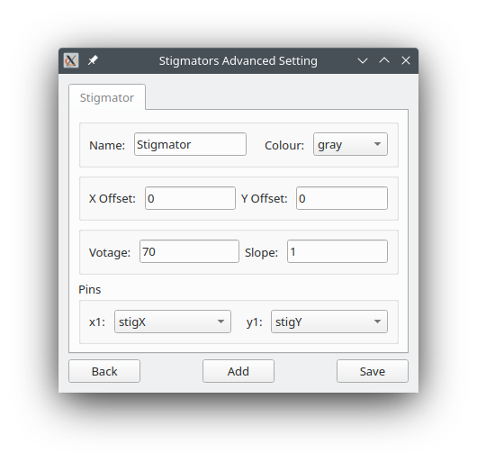
    <p align="right">(<a href="#readme-top">back to top</a>)</p>
    
- ### Data Set

  For user convienience, NanoMi control software can store/load all the input values of every module.

  In Load Data Sets tab, user can load all the values of the data set into the software by clicking the load selected data set button on the buttom; You can also load value of any single input by clicking the load button next to the corresponding setting.

  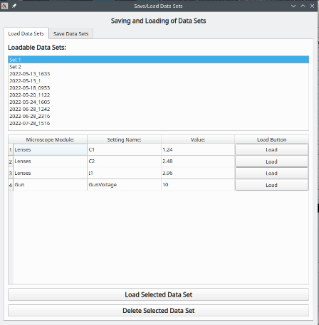

  In Save Data Sets tabl, user can preview all the data, and name the data set, by default the name will be the current data and time. Every set's name has to be unique, and all the data sets are stored in DataSets.xml

  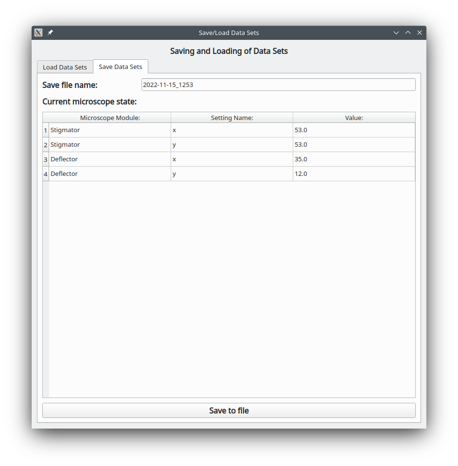


<p align="right">(<a href="#readme-top">back to top</a>)</p>


<!-- CONTRIBUTING -->
## Contributing

Contributions are what make the open source community such an amazing place to learn, inspire, and create. Any contributions you make are **greatly appreciated**.

If you have a suggestion that would make this better, please fork the repo and create a pull request. You can also simply open an issue with the tag "enhancement".
Don't forget to give the project a star! Thanks again!

1. Fork the Project
2. Create your Feature Branch (`git checkout -b feature/AmazingFeature`)
3. Commit your Changes (`git commit -m 'Add some AmazingFeature'`)
4. Push to the Branch (`git push origin feature/AmazingFeature`)
5. Open a Pull Request

<p align="right">(<a href="#readme-top">back to top</a>)</p>


<!-- LICENSE -->
## License

Distributed under the GNU License. See `LICENSE.txt` for more information.

<p align="right">(<a href="#readme-top">back to top</a>)</p>


<!-- CONTACT -->
## Contact Info
For questions about the software and bug reporting, feel free to use the github issue page to post your question.

If you made any contribution, please make a pull request and our team will review it.

Any question relates to hardware or other inquiries, please contact the following emails:

NanoMi Team Email - NRC.NanoMi.CNRC@nrc-cnrc.gc.ca

Mark Salomons - Mark.Salomons@nrc-cnrc.gc.ca

Marek Malac - mmalac@ualberta.ca

You can also track/contact us through OSF:

OSF Project Link: [https://osf.io/bpj73/](https://osf.io/bpj73/)

<p align="right">(<a href="#readme-top">back to top</a>)</p>


